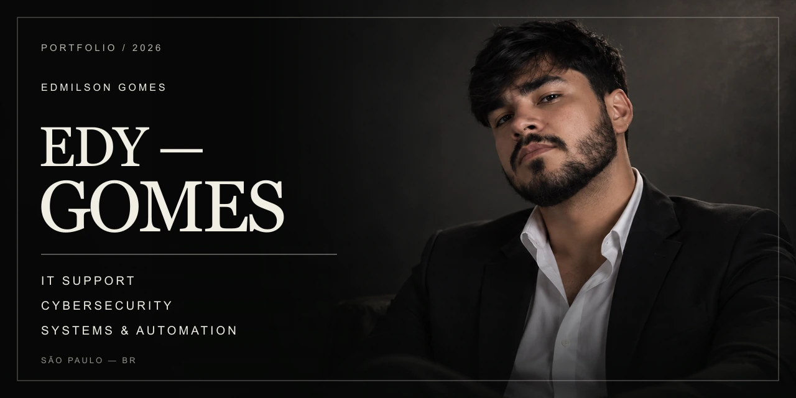
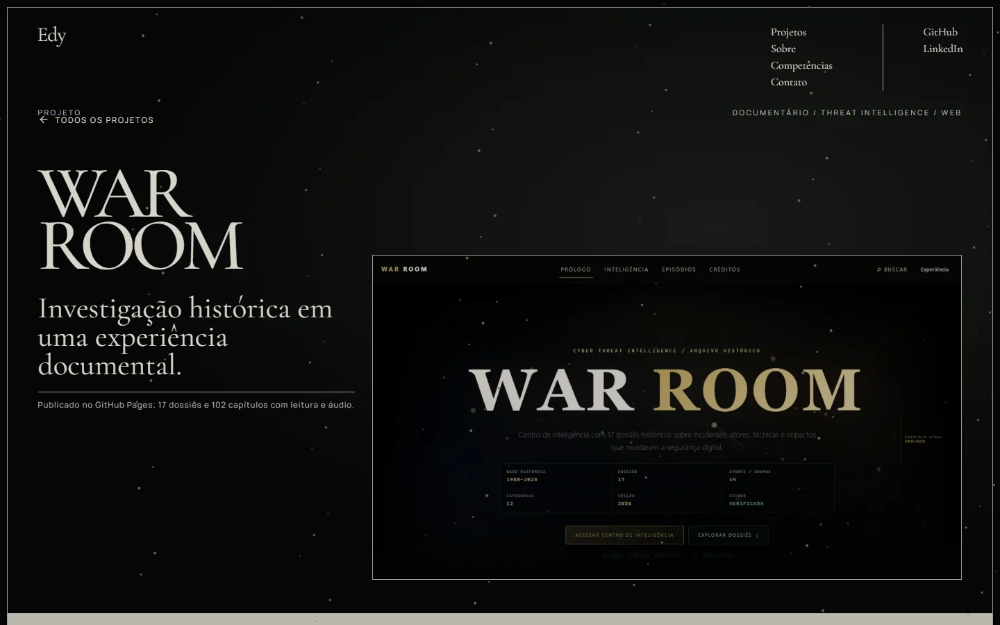
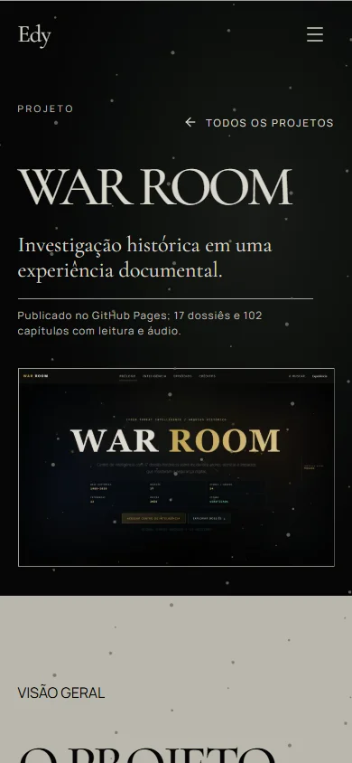
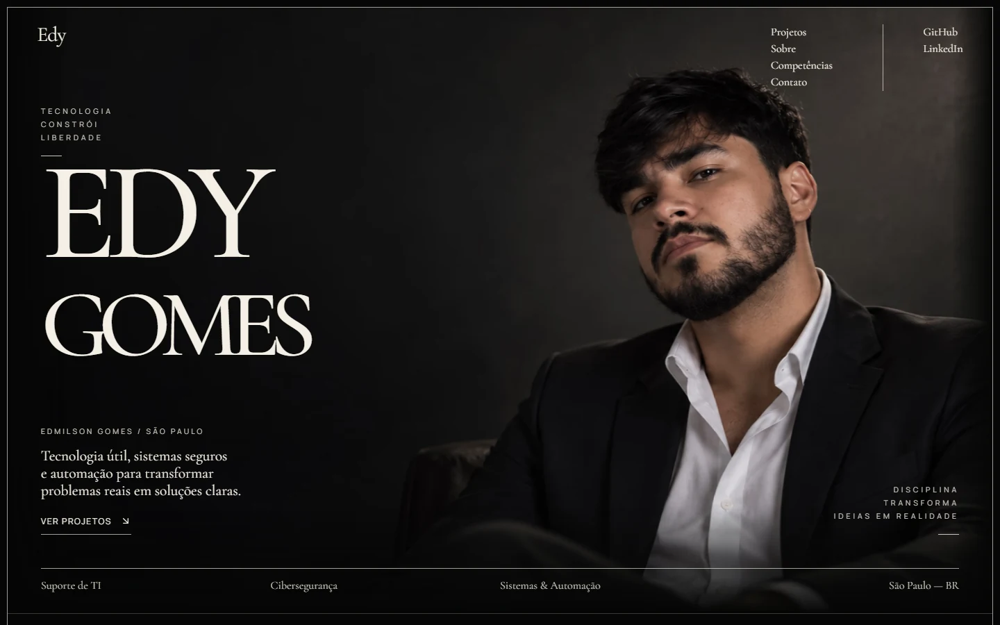
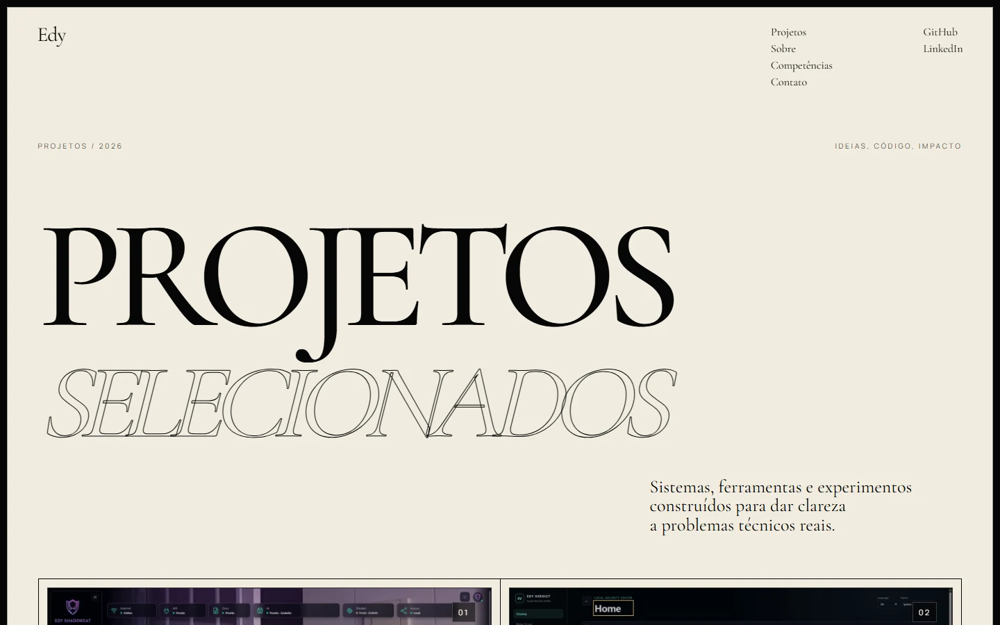
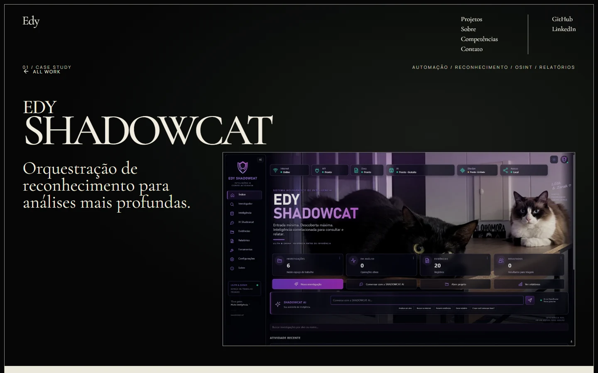
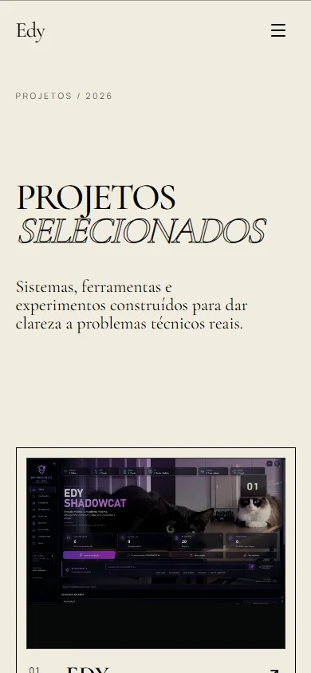
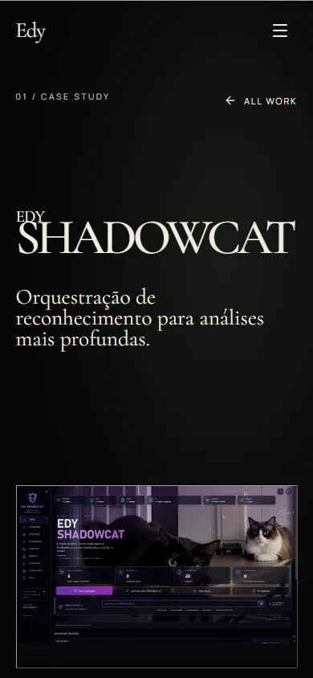

# EDY — GOMES

Portfólio editorial de **Edmilson Gomes** dedicado a projetos reais de **IT Support**, **Cybersecurity** e **Systems & Automation**.

Uma experiência responsiva, cinematográfica e orientada a case studies — construída para apresentar problemas, decisões técnicas e resultados com clareza.

**[LIVE DEMO](https://edy-gomes-portfolio.edy-scanurl-family-worker.workers.dev/)** · **[GITHUB](https://github.com/EDY075/EDY-Portfolio)** · **[LINKEDIN](https://www.linkedin.com/in/edmilsongomes21/)**

## Apresentação em vídeo

https://github.com/user-attachments/assets/7668f4da-9530-4102-8719-9fa3e71c3e60

## Sobre o projeto

EDY — GOMES é o portfólio pessoal de Edmilson Gomes. O projeto combina direção visual editorial, fotografia aprovada e capturas autênticas de produto para apresentar treze cases nas áreas de suporte, segurança, automação e análise.

Desktop e mobile possuem composições próprias. A experiência preserva hierarquia, legibilidade e navegação narrativa em cada formato, sem tratar o mobile como uma simples redução do layout amplo.

## Projetos em destaque

| Projeto | Categoria | Visão geral |
|---|---|---|
| [EDY CRM](https://github.com/EDY075/EDY-CRM) | Prospecção · Composição visual | Workspace local com briefs versionados, montagem por seção e prévias; demonstração pública com dados fictícios. |
| [CR Fitness](https://edy-gomes-portfolio.edy-scanurl-family-worker.workers.dev/work/cr-fitness) | Site institucional · Cliente | Identidade, modalidades, planos e informações da academia em um site publicado. |
| [EDY SOC Analytics](https://edy-gomes-portfolio.edy-scanurl-family-worker.workers.dev/work/edy-soc-analytics) | Power BI · Security Analytics | Dez páginas analíticas com prioridades, SLA e qualidade das fontes; dados sintéticos. |
| [Assistente Personalizado](https://edy-gomes-portfolio.edy-scanurl-family-worker.workers.dev/work/assistente-personalizado) | Automação · Caso real privado | Consultas autorizadas, documentos e lembretes pelo Telegram; sem acesso público ao assistente. |
| [EDY SHADOWCAT](https://edy-gomes-portfolio.edy-scanurl-family-worker.workers.dev/work/edy-shadowcat) | Investigação · Evidências | Pipeline local de 13 etapas, proveniência e relatórios; case com demonstração sintética aprovada. |
| [EDY RECON](https://edy-gomes-portfolio.edy-scanurl-family-worker.workers.dev/work/edy-recon) | OSINT · Python | Toolkit de reconhecimento autorizado; a distribuição pública demonstra os fluxos offline. |
| [WAR ROOM](https://edy-gomes-portfolio.edy-scanurl-family-worker.workers.dev/work/war-room) | Documentário · Threat Intelligence | 17 dossiês, 102 capítulos, cartografia e narração autorizada baseada na voz do autor. |

Treze cases únicos compõem o catálogo completo. A [curadoria cinematográfica](docs/PORTFOLIO_CURATION_2026-10-06.md) apresenta a nova seleção, três artes de capa e oito imagens adicionais dos projetos. Os cases separam origem, problema, solução, funcionalidades e imagens internas; artes ilustrativas não são apresentadas como capturas reais.

## WAR ROOM · edição documental

[Abra o case atualizado](https://edy-gomes-portfolio.edy-scanurl-family-worker.workers.dev/work/war-room) para explorar a cartografia, os capítulos e os 17 episódios completos com narração autorizada baseada na voz do autor. As imagens abaixo são capturas do portfólio publicado em 03/10/2026.

<p>
  
  
</p>

## Experiência desktop

Direção visual de alto contraste, tipografia editorial e projetos apresentados com espaço para contexto.



<table>
  <tr>
    <td width="50%"></td>
    <td width="50%"></td>
  </tr>
  <tr>
    <td align="center"><sub>Selected Work</sub></td>
    <td align="center"><sub>Case Study</sub></td>
  </tr>
</table>

## Experiência mobile

O mobile recompõe tipografia, retrato, navegação e mídia para `390×844`, mantém scroll nativo e entrega assets responsivos adequados ao viewport.

<p align="center">
  
  
  
</p>

## Stack

- React 19 e TypeScript 5.9
- Vinext 1.0 beta, Vite 8 e App Router
- Tailwind CSS 4
- Framer Motion 12
- GSAP 3 com ScrollTrigger
- Lenis no desktop; scroll nativo no mobile
- Cloudflare Workers no ambiente de produção

## Motion e UX

- Revelações editoriais e transições de página com Framer Motion.
- Sequências controladas com GSAP e ScrollTrigger.
- Lenis restrito ao desktop e a dispositivos de ponteiro preciso.
- Navegação sequencial com **Next Chapter** e **Next Project**.
- Hover suspenso durante o momentum de scroll para evitar competição visual.
- Suporte a `prefers-reduced-motion`, teclado e foco visível.

## Performance

Baseline histórico anterior à integração do WAR ROOM (não mede a atualização de 03/10/2026):

| Métrica | Desktop | Mobile |
|---|---:|---:|
| Lighthouse Performance | **100** | **92** |
| Largest Contentful Paint | **646 ms** | **3,114 s** |
| Accessibility | **100** | **100** |
| Best Practices | **100** | **100** |
| SEO | **100** | **100** |
| Cumulative Layout Shift | **0** | **0** |

O perfil de rolagem validado registrou **0 long tasks**.

## Qualidade e validação

Revisão de 06/10/2026: [relatório de escopo, testes e pendências](docs/PORTFOLIO_REVIEW_2026-10-06.md). O EDY CRM, as ações `Ver case` e as correções da galeria estão integrados. Build, lint, tipagem e inspeção responsiva de 320 a 2560 px passaram. A auditoria de dependências mantém seis alertas altos na cadeia de ferramentas de build do Vinext, sem versão corrigida disponível para `braces`.

Os itens abaixo pertencem ao baseline anterior. A validação da publicação atual está registrada em [docs/DEPLOYMENT.md](docs/DEPLOYMENT.md).

- 11/11 rotas públicas verificadas.
- 0 vulnerabilidades conhecidas em dependências de produção no baseline validado.
- Auditoria de segredos e headers de segurança: PASS.
- QA visual desktop e mobile: PASS.
- Teste físico em Poco X5 Pro: PASS.
- Viewports cobertos: `390×844`, `430×932`, `1440×900`, `1920×1080` e `2560×1440`.

## Atualização de 06/10/2026

O EDY CRM entra como o sétimo destaque, com duas capturas reais da demonstração. A galeria 3D distingue clique de arrasto para abrir os cases, e os controles deixam de exibir setas. Ajustes de espaçamento cobrem desktop, tablet e celular. A validação e a publicação desta entrega serão registradas em [docs/DEPLOYMENT.md](docs/DEPLOYMENT.md).

## Desenvolvimento local

Requisitos: Node.js 22.13 ou superior.

```bash
npm ci
npm run dev
```

Use a URL exibida pelo servidor. Gates locais disponíveis:

```bash
npm run lint
npm run typecheck
npm run build
npm audit --omit=dev
```

## Estrutura do projeto

```text
app/          rotas, layouts e metadata
components/   interface, navegação e motion
data/         textos, projetos, bio e links
lib/          SEO, GSAP, scroll e utilitários
public/       retratos e assets responsivos do site
docs/         documentação e apresentação do repositório
```

## Editando conteúdo

- Textos gerais, localização e links: `data/site.ts`
- Projetos e case studies: `data/projects.ts`
- Biografia, valores e capacidades: `data/about.ts`
- Retratos e imagens responsivas: `public/images/`
- Estilos e tokens: `app/globals.css`
- Metadata global: `app/layout.tsx`

## Documentação

- [Aprendizados do projeto](docs/PROJECT_LEARNINGS.md)
- [Playbook de design, motion, performance e QA](docs/CODEX_WEB_PROJECT_MEMORY.md)
